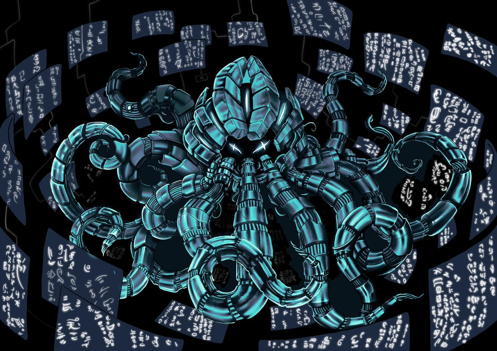

<div align="center">

</div>

# Starknet Stack

`````mermaid
flowchart LR
	A("Client") ==>|"Starknet Transactions"| subGraph0["Sequencer"]
	subGraph0 -.->|"Blocks with txs"| 300319["Watcher prover"]
	300319 ==>|"Request blocks through RPC "| subGraph0
	300319 ==>|"STARK proofs"| 495216[("Proof Storage\n")]
	style 495216 stroke-dasharray: 5
	subgraph 300319["Watcher prover"]
		320311("Cairo VM") ==>|"trace"| 993791("Lambdaworks Prover")
	end
	subgraph subGraph0["Sequencer"]
		C("Consensus") ==x|"tx settlement"| B("Cairo Native")
		B -.->|"tx execution info"| C
	end
`````

## Overview

Starknet stack is a set of technologies to launch and run high-performance decentralized validity blockchains based on Starknet and Cairo. It encompasses the whole cycle: Sequencing user transactions into blocks, executing them, and generating validity proofs, in order to settle state transitions while maintaining high throughput and transparency.

There are two main components to the cycle:

- [Sequencer](/sequencer): The sequencing side of the flow written in Rust, which includes user transaction settlement and execution through [Cairo Native](https://github.com/lambdaclass/cairo_native).
- [Watcher-Prover](/watcher_prover): A service that can be deployed independently which is in charge of requesting blocks with transactions to the sequencer nodes, in order to get transactions and generate traces with [Cairo VM](https://github.com/lambdaclass/cairo-vm/) which are later proved by our [Lambdaworks Starknet Prover](https://github.com/lambdaclass/starknet_stack_prover_lambdaworks). The proofs are later stored for users to query them accordingly.

There is further information for each component in their respective subdirectories.

Additionally, you can also explore the blockchain with [Starknet Stack Explorer](https://github.com/lambdaclass/starknet_stack_explorer).

## Quick start

To run this locally through Docker, do:

```
make run-local
```

This will deploy 4 consensus nodes, the watcher-prover, and the blockchain Explorer. Before finishing, a client that sends a bunch of transactions is executed. The consensus nodes implement the Starknet RPC (partially for now), so you can curl the endpoints appropriately. You can also access the Madara explorer at http://localhost:4000/ and check out the blockchain. 

When finished, don't forget to stop the containers by doing `make stop`.

### Send transactions

A mentioned above, as part of `make run-local`, a client that sends random transactions to the sequencer will run for a short while in order to populate the blockchain. You can also run the client on demand (`make run-client`).

### Flow

- The client sends random invoke transactions (either a fibonacci or factorial execution) to the consensus nodes which execute them with Cairo Native
- Consensus nodes vote on blocks and commit them accordingly. If no transactions are sent, empty blocks are created regularly
- In parallel, the watcher-prover is querying the RPC endpoints and checking transactions on blocks
- When the watcher-prover gets a new block/transaction, it proves the execution through the CairoVM and the LambdaWorks prover
- Proofs get saved either on the file system or on S3 (by default, the filesystem)
- On the explorer, you can browse blocks and see the transactions they include

## Trust assumptions

- There is currently no way to validate whether a proof of an execution is related to a specific transaction. This is planned for the future
- The fact that the prover pool requests the blocks/transactions from the sequencer means that there needs to be trust between them, which is why running a trusted node alongside the proving pool is encouraged. Alternatively, because we use BFT consensus, the user could also query 2/3 of the nodes in order to validate consensus (although this has its own set of downsides)

## Missing Features
- Support for ERC-20 using Starknet in Rust with Cairo Native
- One proof per block including all transactions
- Include missing builtins to the Stark Prover
- Account Support
- Prove StarknetOS
- Native tokens for Proof of Stake
- Support for multiple Consensus Algorithms
- Add generalized program support (programs are not currently stored, only fibonacci/factorial are executed)


