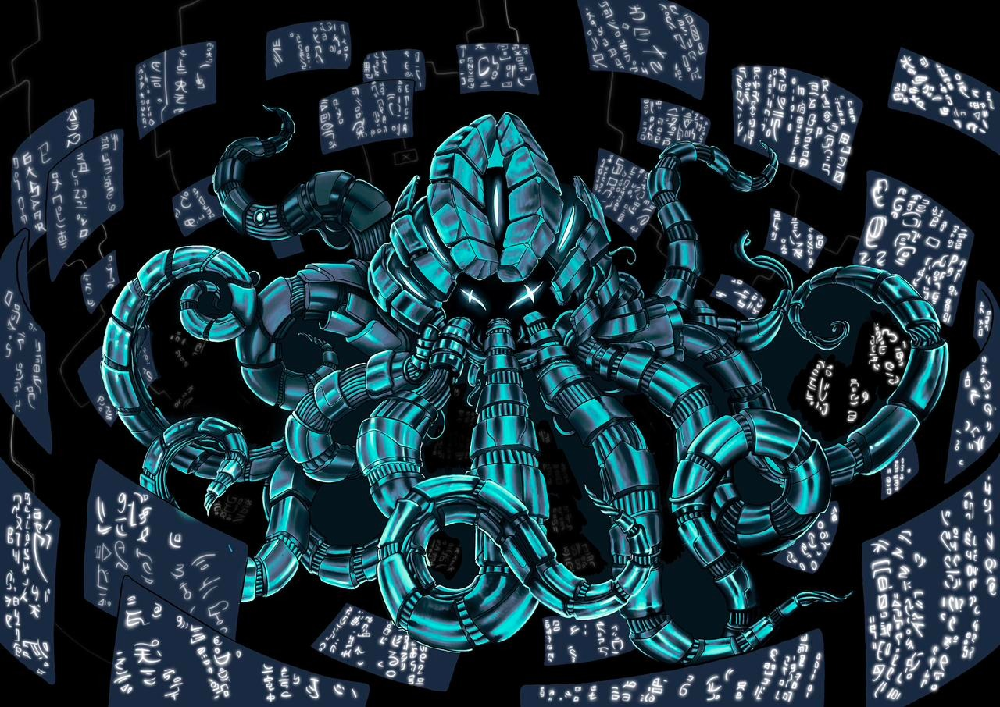

<div align="center">

</div>

# Starknet Stack

`````mermaid
flowchart LR
	A("Client") ==>|"Starknet Transactions"| Sequencer
	Sequencer -.->|"Blocks with txs"| watcher-prover["Watcher prover"]
	watcher-prover ==>|"Request blocks through RPC "| Sequencer
	watcher-prover ==>|"STARK proofs"| Db[("Proof Storage")]
	style Db stroke-dasharray: 5
	subgraph watcher-prover["Watcher prover"]
		cairo-vm("Cairo VM") ==>|"trace"| prover("Lambdaworks STARK Platinum Prover")
	end
	subgraph Sequencer
		C("Consensus") ==x|"tx settlement"| B("Cairo Native")
		B -.->|"tx execution info"| C
	end
    Sequencer ===>|"Blockchain data"| Explorer("Web explorer + verifier")
    Db <-.-> |"Verifiable proofs"| Explorer
    
`````

## Overview

Starknet stack is a set of technologies to launch and run high-performance decentralized validity blockchains based on Starknet and Cairo. It encompasses the whole cycle: Sequencing user transactions into blocks, executing them, and generating validity proofs, in order to settle state transitions while maintaining high throughput and transparency.

There are three main components to the cycle:

- [Sequencer](/sequencer): The sequencing side of the flow written in Rust, which includes user transaction settlement and execution through [Cairo Native](https://github.com/lambdaclass/cairo_native).
- [Watcher-Prover](/watcher_prover): A service that can be deployed independently which is in charge of requesting blocks with transactions to the sequencer nodes, in order to get transactions and generate traces with [Cairo VM](https://github.com/lambdaclass/cairo-vm/) which are later proved by our [Lambdaworks STARK Platinum Prover](https://github.com/lambdaclass/starknet_stack_prover_lambdaworks). The proofs are later stored for users to query them accordingly.
- [Explorer](https://github.com/lambdaclass/madara_explorer): Lastly, you can also explore the blockchain and verify proofs in the browser using our blockchain-agnostic Madara Explorer.

There is further information for each component in their respective subdirectories.

## Quick start

To run this locally through Docker, clone this repo and then do:

```
make run-local
```

This will compile the containers and, through Docker, deploy 4 consensus nodes, the watcher-prover, and the blockchain Explorer. Before finishing, a client that sends a bunch of transactions is executed. The consensus nodes implement the Starknet RPC (partially for now), so you can cURL the endpoints appropriately. You can also access the Madara explorer at http://localhost:4000/ and check out the blockchain alongside the proof status. 

When finished, don't forget to stop the containers by running `make stop`.

By default the execution in the Sequencer is done with Cairo Native. If you wish to use CairoVM then you will need to change `cairo_native` for `cairovm` in the `config/parameters.json` file in the Sequencer.

### Send transactions

A mentioned above, as part of `make run-local`, a client that sends random transactions to the sequencer will run for a short while in order to populate the blockchain. You can also run the client on demand (`make run-client`).

### Flow

- The client sends random invoke transactions (either a fibonacci or factorial execution) to the consensus nodes which execute them with Cairo Native
- Consensus nodes vote on blocks and commit them accordingly. If no transactions are sent, empty blocks are created regularly
- In parallel, the watcher-prover is querying the RPC endpoints and checking transactions on blocks
- When the watcher-prover gets a new block/transaction, it proves the execution through the CairoVM and the LambdaWorks STARK Platinum Prover
- Proofs get saved either on the file system or on S3 (by default, the filesystem under `./proofs`)
- On the explorer, you can browse blocks and see the transactions they include, along with the status of its proof:
	- The `Local verification` field indicates whether the proof is available and if it has been verified on the browser. If, after waiting a few seconds, the field says `Verified`, it means the explorer has retrieved the proof and it has been verified on the browser. If it's `Pending`, the proof has not yet been made available by the watcher-prover.

> You can enable or disable block verification on the browser by setting `ENABLE_BLOCK_VERIFICATION` to `true` or `false` respectively in the environment that runs the explorer. If it is not set, it will default to disabling it. The included [`docker-compose.yaml`](https://github.com/lambdaclass/kraken_zk_stack/blob/5006cc367b3dffe1a6fb5158fe72181e3e7c3c69/docker-compose.yml#L131) deploys the explorer configured to retrieve proofs locally and with block verification enabled

### How to store proofs on S3

As mentioned, the proofs are saved by default on the file system, but the option exists to save them on S3 buckets. In order to set this up, the following environment variables need to be set in docker-compose.yml for the [`watcher_prover` container](https://github.com/lambdaclass/starknet_stack/blob/8ff555d2dfb5bd3631f9bf6c81a602b63a35f5b4/docker-compose.yml#L93C11-L93C29):

- `PROVER_STORAGE=s3`
- `AWS_ACCESS_KEY_ID` needs to be set to your AWS access key id
- `AWS_SECRET_ACCESS_KEY` needs to be set to your AWS secret access key
- `AWS_REGION` should be set to the desired AWS region
- `S3_BUCKET_NAME` needs to be set to the S3 bucket in which to store the proofs

Note that when S3 is chosen as the storage backend, the explorer needs to also know about the same AWS settings in order to retrieve proofs and verify them on the browser, which is why the same variables described above need to be set for the [explorer container](https://github.com/lambdaclass/starknet_stack/blob/8ff555d2dfb5bd3631f9bf6c81a602b63a35f5b4/docker-compose.yml#L125).

## Trust assumptions

- There is currently no way to validate whether a proof of an execution is related to a specific transaction. This is planned for the future
- The fact that the prover pool requests the blocks/transactions from the sequencer means that there needs to be trust between them, which is why running a trusted node alongside the proving pool is encouraged. Alternatively, because we use BFT consensus, the user could also query 2/3 of the nodes in order to validate consensus (although this has its own set of downsides)

## Missing Features
- ~~Support for ERC-20 using Starknet in Rust with Cairo Native~~ ✔️
- One proof per block including all transactions
- Include missing builtins to the Stark Prover
- Account Support
- Prove StarknetOS
- Native tokens for Proof of Stake
- Support for multiple Consensus Algorithms
- Add generalized program support (programs are not currently stored, only fibonacci/factorial are executed)


